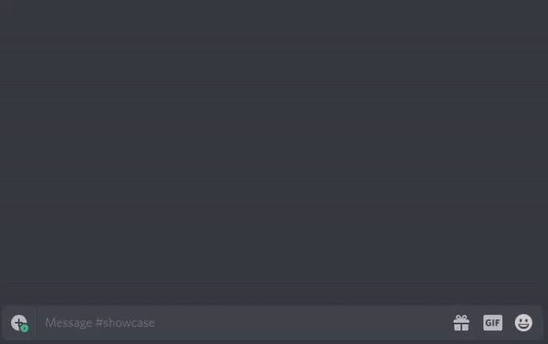

# ColorBot
## About
A discord bot that gives a random color role to every member in a guild.

## Setup
1. Clone `https://github.com/valkyrienyanko/ColorBot.git`
2. Download and install `LTS` [Node.js](https://nodejs.org/en/)
3. Install yarn `npm i -g yarn`
4. Run `yarn install` in the project root directory
5. Generate a bot token from the [Discord Developers Portal](https://discordapp.com/developers/applications/)
6. Update `.env` with your bot token
7. Start server with `yarn dev:server`
8. Create an invite link for the bot by grabbing its token ID and putting it in the following URL `https://discordapp.com/api/oauth2/authorize?client_id=ID&scope=bot&permissions=27649`
9. Continue setup with `v!help`

## Contribute
Check the current [issues](https://github.com/valkyrienyanko/ColorBot/issues).
